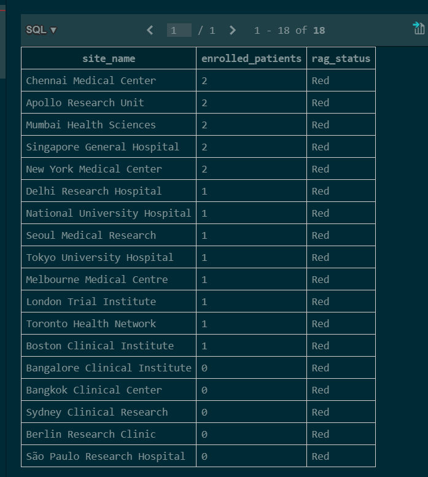
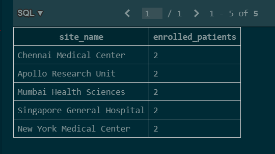
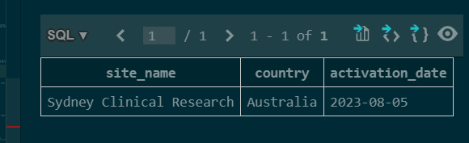
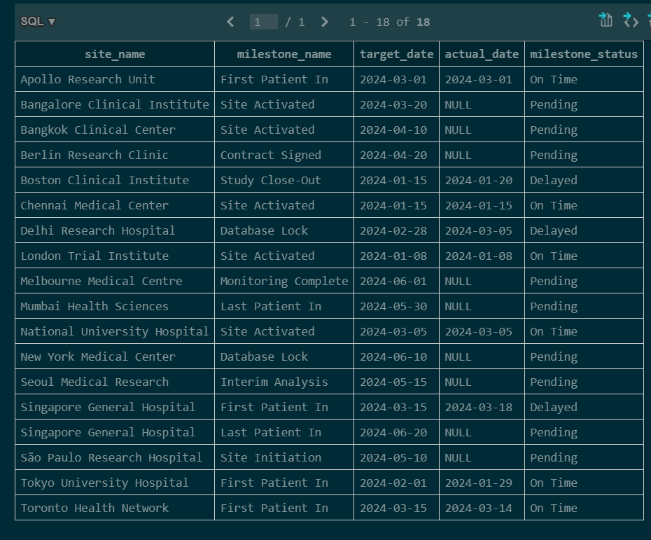
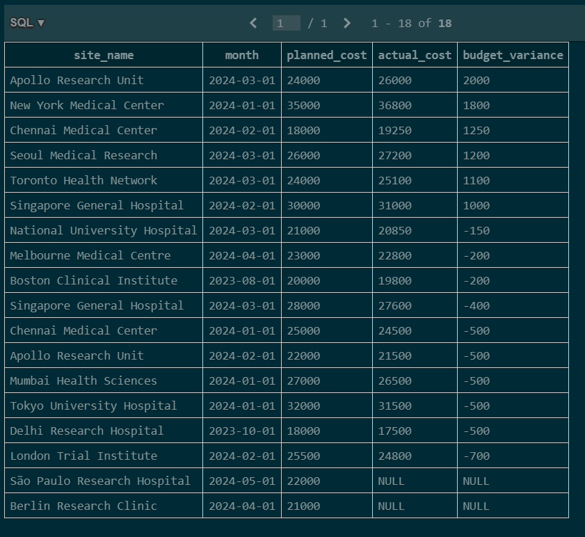
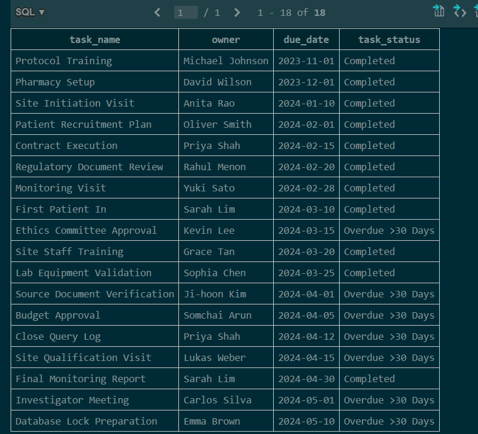
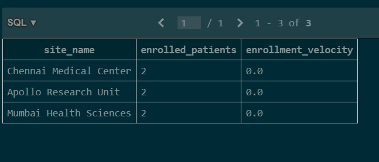
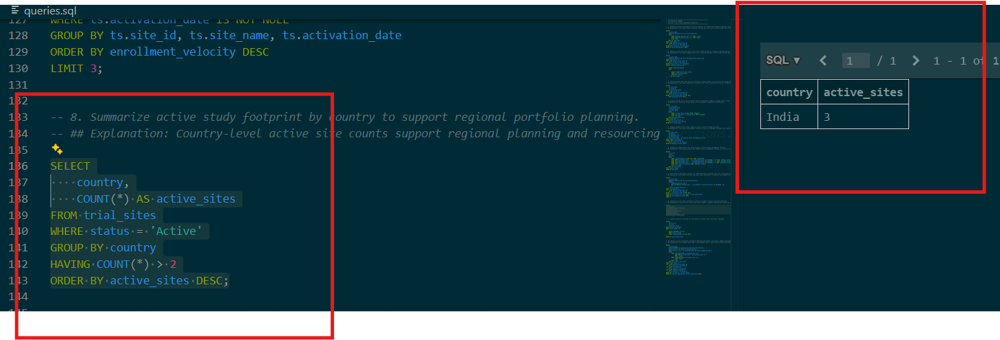
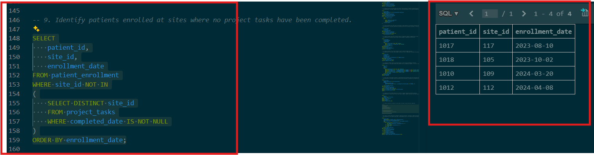
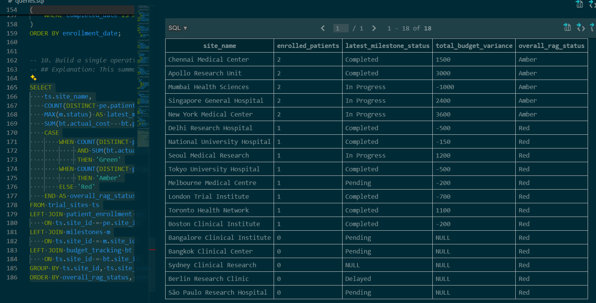

# Clinical Trial SQL Portfolio

A SQL portfolio project demonstrating how SQL can be used to solve real-world clinical trial project management problems. The dataset models common activities performed by Project Managers in CROs and pharmaceutical organizations, including site activation, patient enrollment, milestone tracking, task management, and budget monitoring.

The goal of this project is to showcase practical SQL skills through business-focused reporting rather than isolated syntax exercises.

---

## Project Structure

```
SQL-PORTFOLIO/
│
├── schema.sql                 # Database schema
├── sample_data.sql            # Sample clinical trial dataset
├── queries.sql                # 10 business-focused SQL queries
├── clinical_trials.db         # SQLite database
│
├── screenshots/
│   ├── 01_rag_status.png
│   ├── 02_Sites_enrolling_above_average.png
│   ├── 03_prioritize_follow-up.png
│   ├── 04_schedule_slippage.png
│   ├── 05_budget_variance.png
│   ├── 06_tasks_ageing.png
│   ├── 07_enrollment_velocity.png
│   ├── 08_regional_planning.png
│   ├── 09_patients_enrolled_without_tasksprogress.png
│   └── 10_operational_dashboard.png
│
└── README.md
```

---

## Database Overview

The project consists of five related tables representing a simplified clinical trial project.

| Table | Description |
|--------|-------------|
| **trial_sites** | Site information, activation status and country |
| **patient_enrollment** | Patient enrollment and withdrawal records |
| **project_tasks** | Operational project tasks assigned to each site |
| **milestones** | Study milestones and schedule tracking |
| **budget_tracking** | Planned versus actual monthly site costs |

---

# SQL Business Reports

---

## 1. Site Enrollment Summary with RAG Status

**Business Objective**

Identify recruitment performance across study sites by categorizing enrollment into Red, Amber, and Green performance bands.

**Concepts Used**

- LEFT JOIN
- GROUP BY
- COUNT
- CASE



---

## 2. Sites Enrolling Above Average

**Business Objective**

Identify study sites enrolling more patients than the overall study average to recognize high-performing sites.

**Concepts Used**

- Aggregation
- GROUP BY
- HAVING
- Subquery



---

## 3. Sites with Zero Enrollment Despite Activation

**Business Objective**

Identify activated sites that have not enrolled any patients so project teams can prioritize follow-up.

**Concepts Used**

- LEFT JOIN
- WHERE
- IS NULL



---

## 4. Milestone Slippage Report

**Business Objective**

Compare planned milestone dates with actual completion dates to identify schedule delays.

**Concepts Used**

- INNER JOIN
- CASE
- Date Comparison



---

## 5. Budget Variance by Site

**Business Objective**

Compare planned versus actual spend across sites to monitor budget performance.

**Concepts Used**

- JOIN
- Calculated Columns
- Arithmetic Expressions



---

## 6. Task Overdue Aging Report

**Business Objective**

Group overdue project tasks into aging buckets to prioritize operational follow-up.

**Concepts Used**

- CASE
- Date Functions
- Conditional Logic



---

## 7. Top Performing Sites by Enrollment Velocity

**Business Objective**

Measure patient enrollment speed relative to the time since site activation.

**Concepts Used**

- GROUP BY
- COUNT
- ORDER BY
- LIMIT
- Calculated Metrics



---

## 8. Country-Level Operational Rollup

**Business Objective**

Summarize active study sites by country to support regional resource planning.

**Concepts Used**

- GROUP BY
- HAVING
- Aggregate Functions



---

## 9. Patients Enrolled Without Completed Site Tasks

**Business Objective**

Identify patients enrolled at sites where operational tasks remain incomplete.

**Concepts Used**

- Subquery
- NOT IN



---

## 10. Operational Dashboard

**Business Objective**

Create a single operational report combining enrollment, milestone status, budget performance, and overall RAG status for each study site.

**Concepts Used**

- Multiple JOINs
- GROUP BY
- Aggregate Functions
- CASE
- Calculated Columns



---

# SQL Skills Demonstrated

- SELECT
- WHERE
- ORDER BY
- GROUP BY
- HAVING
- INNER JOIN
- LEFT JOIN
- CASE Statements
- Aggregate Functions
- Correlated & Nested Subqueries
- NULL Handling
- Date Calculations
- Business KPI Reporting
- Clinical Trial Data Analysis

---

# Project Context

This project uses a fictional clinical trial dataset created for portfolio purposes. The scenarios are inspired by common project management activities performed in clinical research, including site activation, enrollment tracking, milestone management, operational reporting, and budget monitoring.
